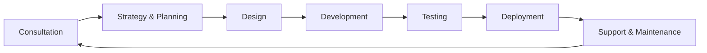

# 🚀 Taskuick

### Web, App Solutions & AI Automations

*Empowering businesses with cutting-edge digital solutions*

---

## 📖 About Taskuick

**Taskuick** is a technology-driven company specializing in **web development**, **mobile app solutions**, and **AI-powered automations**. We help businesses of all sizes—from startups to large enterprises—modernize their digital presence, streamline operations, and leverage artificial intelligence to stay competitive in today's fast-paced digital landscape.

Our mission is to deliver **tailored digital solutions** that align perfectly with your business goals, combining innovation, scalability, and exceptional user experience.

---

## 🎯 What We Do

### 🌐 Web Development
We build dynamic, responsive, and scalable web solutions that drive results:
- **Custom Websites** - From corporate sites to e-commerce platforms
- **Web Applications** - Full-stack development for complex business needs
- **Progressive Web Apps (PWAs)** - Modern, app-like experiences on the web
- **API Development & Integration** - Seamless connectivity with third-party services
- **CMS Solutions** - Easy-to-manage content platforms

### 📱 App Solutions
End-to-end mobile app development services:
- **iOS & Android Apps** - Native and cross-platform development
- **UX/UI Design** - Beautiful, intuitive interfaces
- **App Modernization** - Upgrade legacy applications
- **Deployment & Support** - From ideation to App Store/Play Store launch
- **Maintenance & Updates** - Ongoing support and feature enhancements

### 🤖 AI Automations
Leverage artificial intelligence to transform your business:
- **Process Automation** - Reduce manual workload and increase efficiency
- **Intelligent Workflows** - Smart automation for repetitive tasks
- **Data Analysis & Insights** - AI-powered analytics and reporting
- **Chatbots & Virtual Assistants** - Enhanced customer interactions
- **Machine Learning Solutions** - Predictive models and smart recommendations
- **Document Processing** - Automated data extraction and classification

### 🎨 Custom Solutions
Every business is unique, and so are our solutions:
- **Tailored Development** - Solutions designed specifically for your needs
- **System Integration** - Connect your existing tools and platforms
- **Digital Transformation** - Comprehensive modernization strategies
- **Consulting Services** - Strategic guidance for your digital journey
- **Scalable Architecture** - Solutions that grow with your business

---

## 💡 Why Choose Taskuick?

| 🎯 Client-Focused | 🚀 Innovation-Driven | 📈 Scalable Solutions | 🤝 End-to-End Service |
|-------------------|---------------------|----------------------|----------------------|
| We adopt a consultative approach, understanding your goals before designing solutions | Leveraging the latest technologies in web, mobile, and AI | Our solutions grow with your business needs | From ideation to deployment and beyond |

### Our Approach
1. **Discovery** - We listen to understand your business challenges and objectives
2. **Strategy** - Develop a customized roadmap aligned with your goals
3. **Design** - Create intuitive, user-centered experiences
4. **Development** - Build robust, scalable solutions using best practices
5. **Deployment** - Launch with confidence and comprehensive testing
6. **Support** - Provide ongoing maintenance and optimization

---

## 🏢 Who We Serve

We partner with businesses across industries and sizes:

- **🚀 Startups** - Launch your MVP and scale quickly
- **🏪 SMBs** - Modernize operations and compete digitally
- **🏢 Enterprises** - Transform legacy systems and innovate at scale
- **🛒 E-commerce** - Build powerful online stores
- **🏥 Healthcare** - HIPAA-compliant digital solutions
- **🎓 Education** - Learning management and educational platforms
- **💼 Finance** - Secure, compliant financial applications

---

## 🛠️ Technologies We Work With

### Frontend

### Backend

### Mobile

### AI & ML

### Cloud & DevOps

---

## 📊 Our Process

---

## 🌟 Success Stories

> *"Taskuick transformed our outdated website into a modern, high-performing platform. The AI automation they implemented saved us countless hours every week."*
> 
> — Client Testimonial

> *"From concept to launch, the team at Taskuick was professional, responsive, and delivered exactly what we needed. Our mobile app has been a game-changer for our business."*
> 
> — Client Testimonial

---

## 🚀 Get Started

Ready to transform your business with cutting-edge digital solutions?

### Contact Us

- 🌐 **Website**: [www.taskuick.com](https://www.taskuick.com/)
- 📧 **Email**: info@taskuick.com
- 💼 **LinkedIn**: [linkedin.com/company/taskuick](https://www.linkedin.com/company/taskuick)
- 🐦 **Twitter**: [@taskuick](https://twitter.com/taskuick)

### Let's Build Something Amazing Together!

Whether you need a simple website, a complex enterprise application, or AI-powered automation, we're here to help. Reach out today for a free consultation!

---

## 📝 Latest Updates

Stay tuned for our latest projects, case studies, and technology insights!

- 🔔 Follow us on social media for updates
- 📰 Check out our blog for tech articles and industry insights
- 💡 Subscribe to our newsletter for exclusive content

---

## 📄 License

© 2025 Taskuick. All rights reserved.

---

**Built with ❤️ by Taskuick**

*Empowering businesses through technology*

[Website](https://www.taskuick.com/) • [Services](#-what-we-do) • [Contact](#-get-started)

